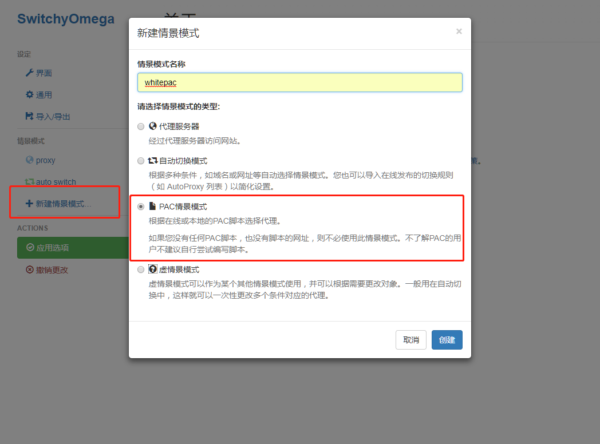
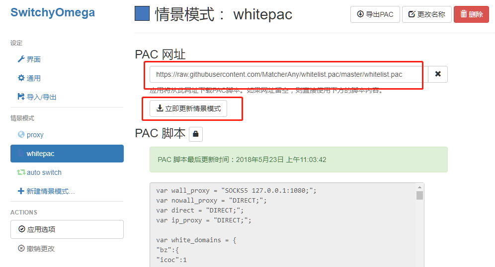
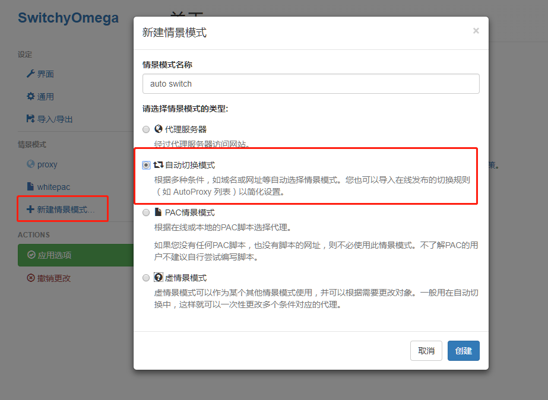
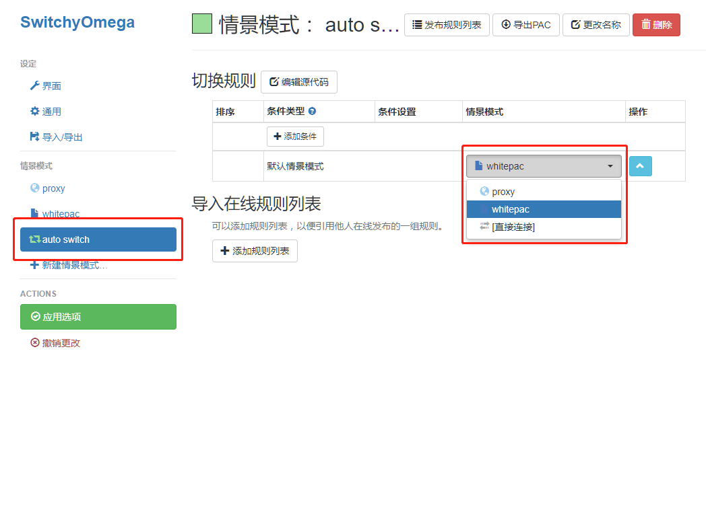
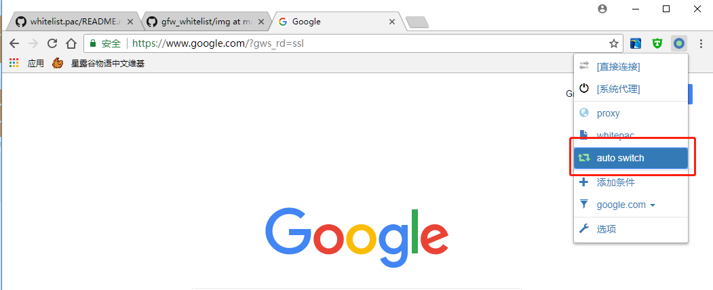

# `概述`

原作者是[pexcn](https://github.com/pexcn)，这个是自己使用的白名单pac文件

# `代理设置方法`

> 确认本机的代理软件的端口是1080，或者是自己按照配置文件修改端口号

## `0x00 Chrome`

### `0x01 安装插件SwitchyOmega`

安装地址:https://chrome.google.com/webstore/detail/proxy-switchyomega/padekgcemlokbadohgkifijomclgjgif

### `0x02 创建情景模式`

 

更新的pac地址: https://raw.githubusercontent.com/MatcherAny/whitelist.pac/master/whitelist.pac

 

### `0x03 选择auto white情景模式`

