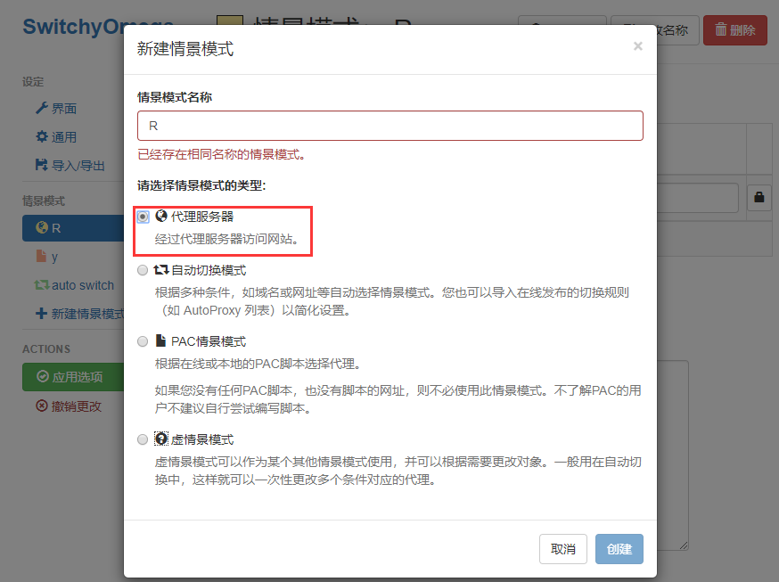
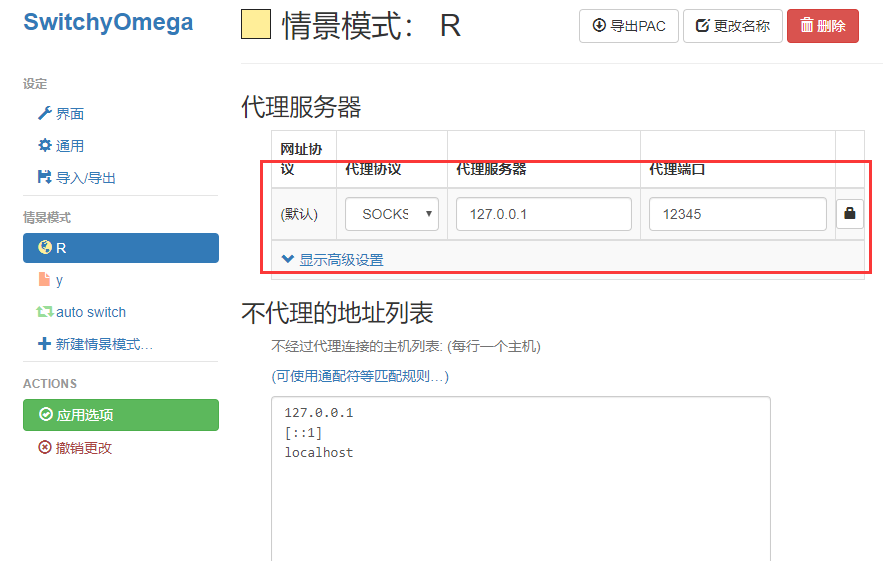
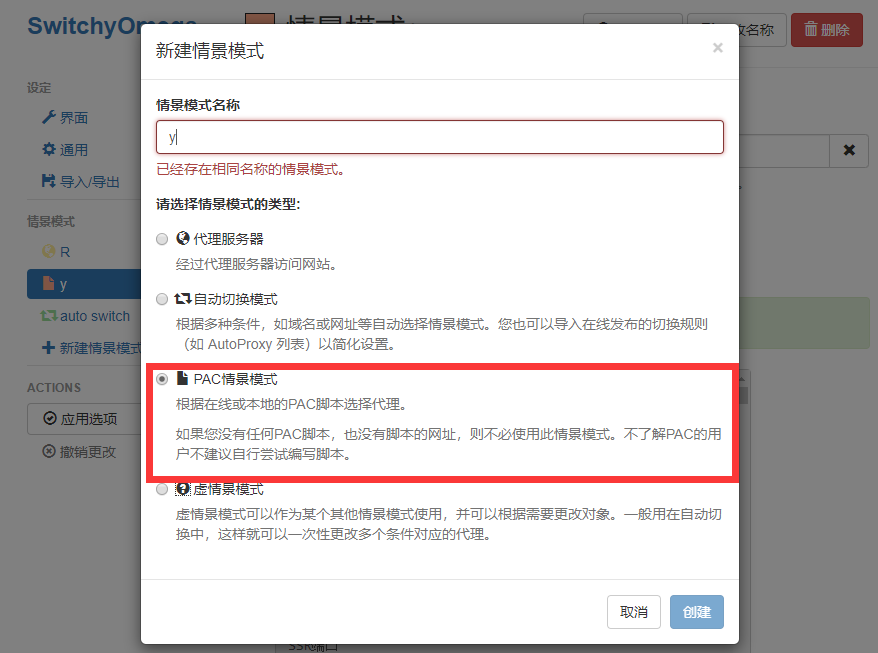
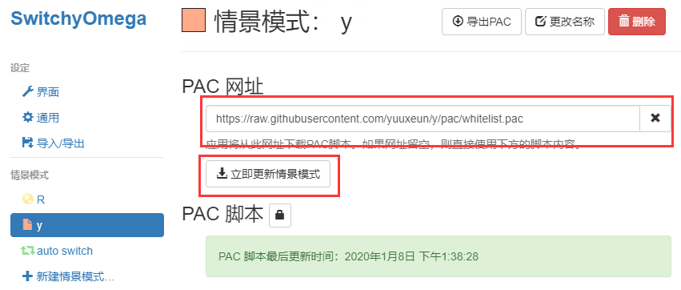
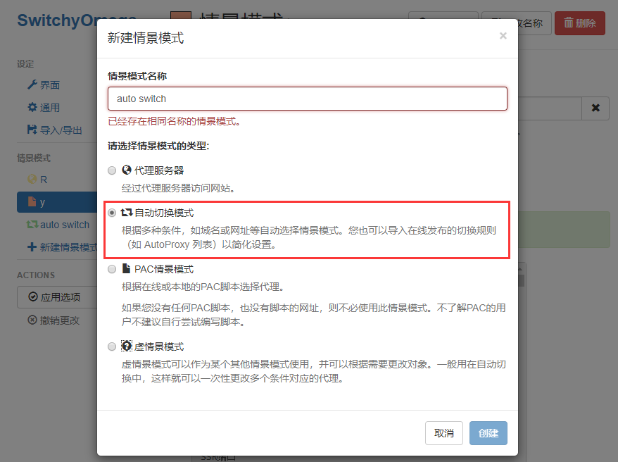
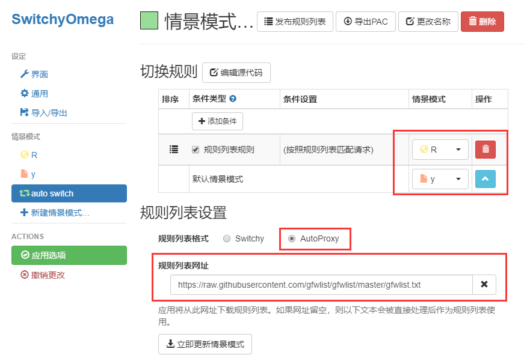
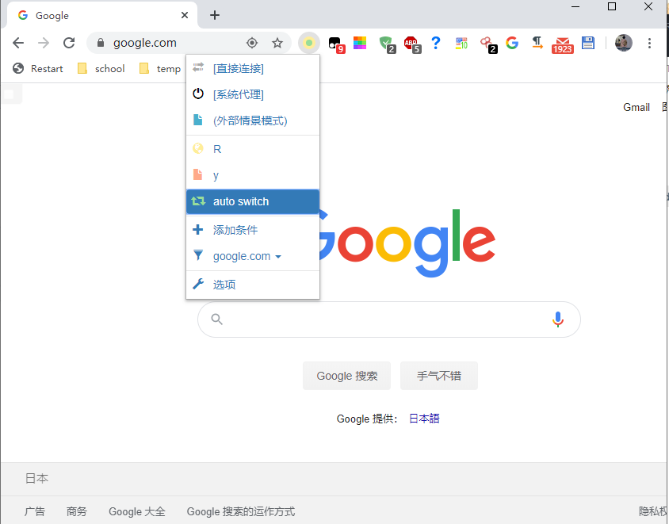

# `概述`

原作者是[pexcn](https://github.com/pexcn), [breakwa11](https://github.com/breakwa11), [MatcherAny](https://github.com/MatcherAny)，这个是经过修改自己使用的白名单pac文件

# `代理设置方法`

> 确认本机的代理软件的端口是`12345`，或者是自己按照配置文件修改端口号

## `0x00 Chrome`

安装Chrome浏览器

### `0x01 安装插件SwitchyOmega`

[安装地址](https://chrome.google.com/webstore/detail/proxy-switchyomega/padekgcemlokbadohgkifijomclgjgif): https://chrome.google.com/webstore/detail/proxy-switchyomega/padekgcemlokbadohgkifijomclgjgif

### `0x02 创建情景模式`

[更新的pac地址](https://raw.githubusercontent.com/yuuxeun/y/pac/whitelist.pac): https://raw.githubusercontent.com/yuuxeun/y/pac/whitelist.pac

[更新的pac地址](https://raw.githubusercontent.com/gfwlist/gfwlist/master/gfwlist.txt): https://raw.githubusercontent.com/gfwlist/gfwlist/master/gfwlist.txt

### `0x03 选择auto white情景模式`

